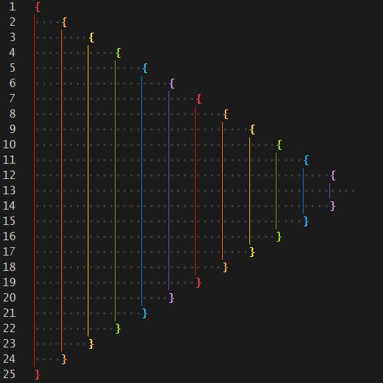

# Installation

1. Open the _**Extensions**_ sidebar in VS Code. `View → Extensions`
2. Search for `Tora VSCode` and install _**Tora's VSCode Theme** by **Toranaado**_
3. `File → Preferences → Color Theme` and select _**ToraVSCode**_

> This theme hasn't been published yet. For now, download a copy of this repo and place the folder in `C:\Users\USERNAME\.vscode\extensions\` then restart VSCode and follow step 3 above.

# Customization

To override anything in this theme that you don't like, follow the guide in the VSCode [Color Theme](https://code.visualstudio.com/api/extension-guides/color-theme) documentation.

# Color Palette
| Color                                              | Hex       | Scope                         |
| -------------------------------------------------- | --------- | ----------------------------- |
|  | `#0D0D0D` | Background                    |
|  | `#808080` | Foreground                    |
|  | `#545454` | Comments                      |
|  | `#CCCCCC` | Variables & Fields            |
|  | `#FFFFFF` | Punctuation & Parameters      |
|  | `#A27ED3` | Constants & Object Properties |
|  | `#1A94FF` | Keywords & Operators          |
|  | `#8AC926` | Entity Types & Support Types  |
|  | `#FFCF4E` | Strings & Functions           |
|  | `#FF924C` | Local Variables               |
|  | `#FF3A40` | Invalid/Misc.                 |

# Rainbow Indent Guides

# Support for [Rainbow CSV](https://github.com/mechatroner/vscode_rainbow_csv)

---
###### Theme released under the [AGPL-3.0 license](https://github.com/TehSeph/ToraVSCode/blob/main/LICENSE.MD) &mdash; Color Palette in this README uses [place-hold.it](https://place-hold.it/)
